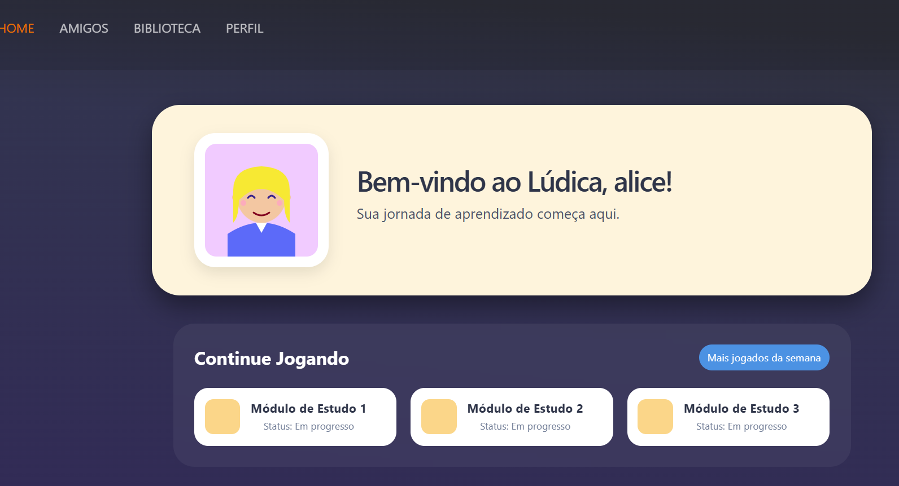
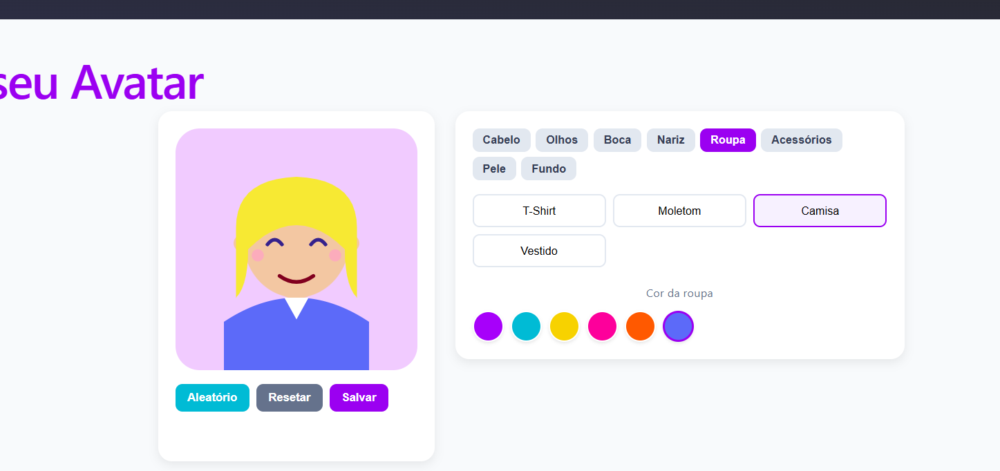
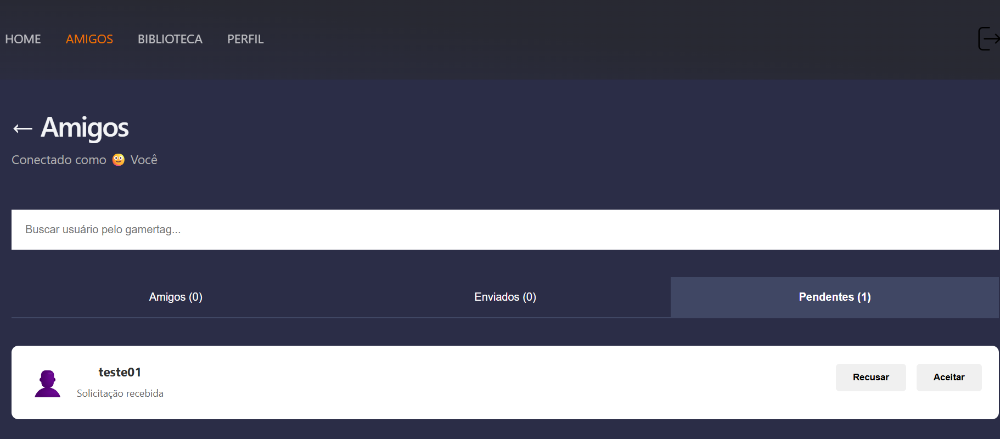
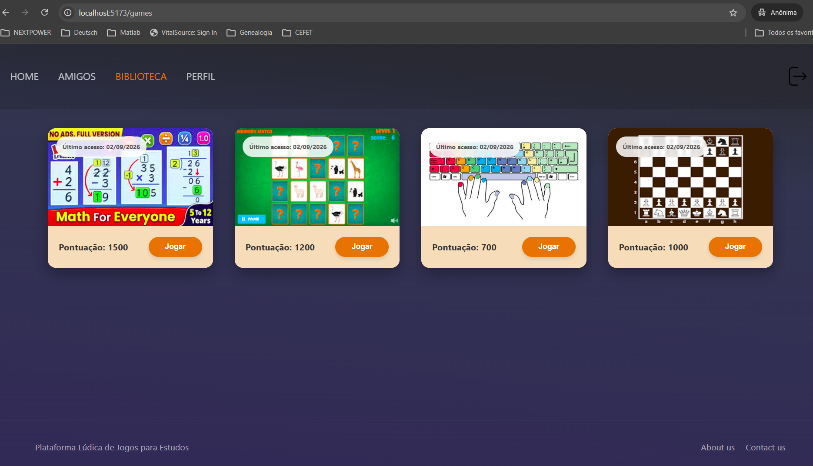
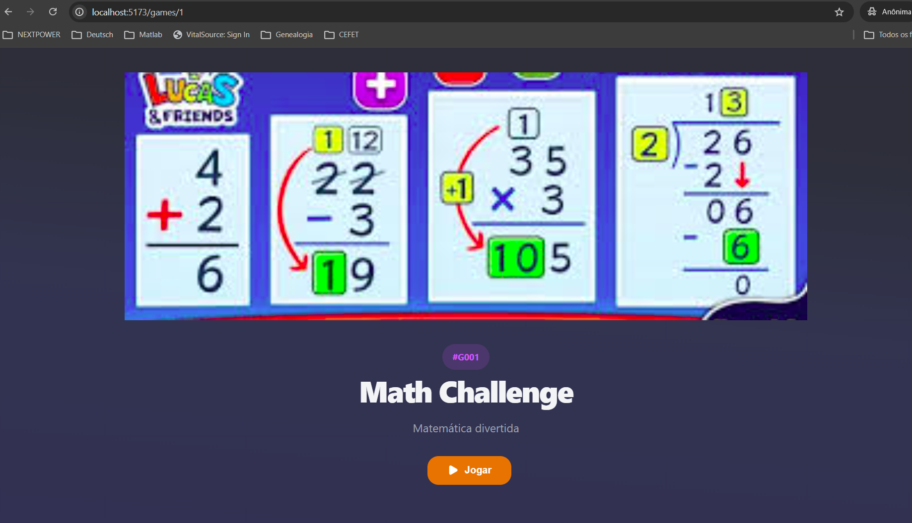
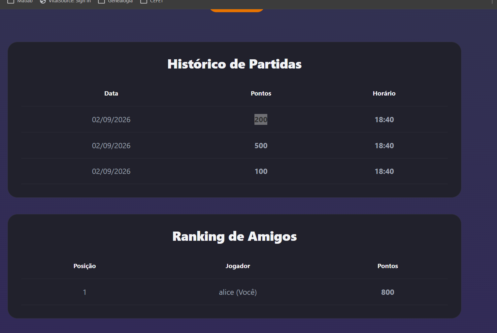
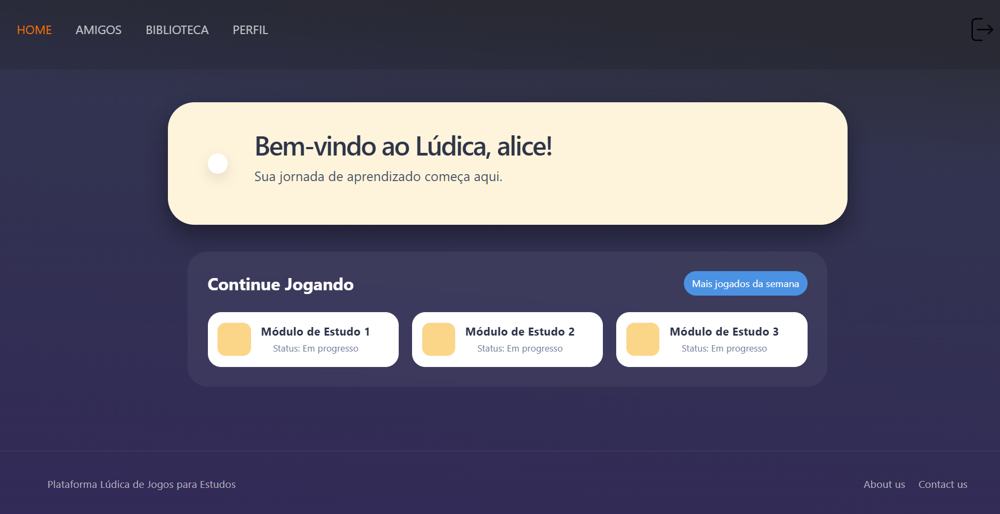

# Relatório de Acompanhamento --- Sprint 01

**Disciplina:** Projetos e Configuração de Sistemas\
**Projeto:** Lúdica --- Plataforma de Aprendizagem Lúdica\
**Sprint:** Sprint 01 --- Ambientação, execução e testes\
**Data da apresentação:** 02/09/2026\
**Integrantes:** 
- Lucas Alves Bittencourt
- João Victor
- Patricia Sales Mansano

------------------------------------------------------------------------

## 1. Objetivo da Sprint

Realizar a ambientação no projeto Lúdica, estudar a documentação
existente, configurar o ambiente de desenvolvimento, executar a
aplicação localmente, testar suas principais funcionalidades e
identificar dificuldades, inconsistências e pontos de evolução
observados durante a execução.

## 2. Atividades planejadas

  
| N°| Atividade | Status |
|---|-----------|--------|
| 1 | Estudar os manuais e a documentação do projeto | Concluída |
| 2 | Configurar o ambiente de desenvolvimento | Concluída |
| 3 | Executar o sistema localmente | Concluída |
| 4 | Testar as funcionalidades existentes | Concluída |
| 5 | Mapear dificuldades e inconsistências | Concluída |
| 6 | Consolidar os resultados da Sprint | Concluída |
| 7 | Iniciar correções das inconsistências identificadas | Em andamento |

## 3. Atividades realizadas

### 3.1 Estudo da documentação

Foram analisados o *Manual do Usuário*, o *Manual do Desenvolvedor*, o
*Documento de Trabalho Futuro* e a *apresentação do projeto*. A documentação
foi utilizada como referência para identificar os fluxos previstos e
separar dificuldades da Sprint de funcionalidades futuras.

### 3.2 Configuração e execução

Foram configurados Docker Desktop e PostgreSQL, Node.js/npm,
dependências do back-end e do front-end. O banco foi inicializado com os
dados de teste disponíveis em `seed.js`.

A aplicação foi executada com a seguinte estrutura:

``` text
PostgreSQL / Docker
        ↓
Back-end Node.js — localhost:3000
        ↓
Front-end React/Vite — localhost:5173
```


### 3.3 Testes funcionais

Os testes foram realizados manualmente, pois o projeto não possui testes
automatizados configurados no script `npm test`.

Foram percorridos os módulos:

**Cadastro → Login → Home → Perfil → Avatar → Amigos → Biblioteca →
Detalhes dos Jogos → Administrador**



## 4. Resultados dos testes

| ID | Funcionalidade | Resultado | Observação |
|---|---|---|---|
| T01 | Cadastro | Parcial | Cadastro funciona, porém Gamertag duplicada foi aceita |
| T02 | Login | Aprovado | Autenticação por Gamertag funcionando |
| T03 | Alteração de senha | Aprovado | Nova senha persistiu e a senha anterior foi rejeitada |
| T04 | Perfil | Corrigido e retestado | Data de nascimento passou a ser exibida corretamente |
| T05 | Avatar | Aprovado | Edição, salvamento e persistência validados |
| T06 | Amigos | Aprovado | Busca, solicitação, aceite e remoção validados |
| T07 | Biblioteca | Aprovado | Jogos exibidos após execução do `seed.js` |
| T08 | Detalhes do jogo | Parcial | Informações carregam, mas o usuário do histórico está fixo no código |
| T09 | Botão Jogar | Não funcional | Botão não possui ação ou navegação implementada |
| T10 | Home | Parcial | Módulos apresentados são estáticos/mockados |
| T11 | Logout | Corrigido e retestado | Botão passou a executar a rotina de limpeza da sessão |
| T12 | Administrador | Parcial | Login funciona, mas não há interface administrativa específica |

### 4.1 Evidências de funcionalidades validadas











## 5. Dificuldades encontradas durante a Sprint

As dificuldades desta seção correspondem aos obstáculos efetivamente encontrados durante a execução das atividades da Sprint, e não às funcionalidades planejadas para versões futuras.

| ID  | Dificuldade | Tratamento / resultado |
|-----|-------------|------------------------|
| D01 | Divergência entre documentação e Docker Compose | Identificado que o Compose atual inicializa apenas o PostgreSQL; front-end e back-end são executados separadamente |
| D02 | Porta do PostgreSQL diferente da documentação | Confirmada a utilização da porta externa `5433`|
| D03 | Biblioteca inicialmente vazia | Identificada a necessidade de executar `seed.js` para carregar os dados de teste |
| D04 | Ausência de testes automatizados | Testes desta Sprint realizados manualmente |
| D05 | `seed.js` reinicializa os dados do banco | Foi necessário considerar a remoção dos usuários/dados criados durante testes anteriores |
| D06 | Comportamentos divergentes da documentação | Diferenças registradas como problemas ou pontos de revisão |

## 6. Problemas e inconsistências identificados

| ID | Problema | Prioridade | Situação |
|---|---|---|---|
| P01 | Gamertag duplicada permitida | Alta | Pendente |
| P02 | Data de nascimento não exibida corretamente no Perfil | Média | **Corrigido e testado** |
| P03 | Histórico/ranking utiliza `id_usuario = 1` fixo | Alta | Pendente |
| P04 | Botão **Jogar** sem ação implementada | Alta | Pendente |
| P05 | Logout não executava corretamente a limpeza da sessão | Alta | **Corrigido e testado** |
| P06 | Avatar do usuário anterior podia permanecer após novo login | Alta | **Corrigido quanto ao vazamento entre sessões** |
| P07 | Perfil Administrador não diferenciado no front-end | Média | Pendente |
| P08 | Componentes da Home permanecem estáticos/mockados | Baixa | Pendente |
### 6.1 Gerenciamento de sessão

Durante os testes foi observado que, após utilizar a conta de Alice e em
seguida autenticar como `admin`, a Home apresentava o nome do novo
usuário, mas mantinha o avatar da sessão anterior.


A análise do código mostrou que existia uma função `handleLogout`, porém
o botão de saída não a executava. A rotina foi associada ao botão e
ampliada para remover os dados da sessão armazenados no `localStorage`.

Após a correção, o avatar da sessão anterior deixou de aparecer:



**Observação:** a correção eliminou o vazamento do avatar entre
usuários. Entretanto, o login ainda não recupera automaticamente do
back-end o avatar persistido do usuário autenticado. Esse ponto
permanece como melhoria futura.

### 6.2 Data de nascimento no Perfil

O back-end armazenava/retornava a data no formato ISO completo, por
exemplo:

``` text
2000-01-01T02:00:00.000Z
```

O campo HTML `date` precisa receber o formato `YYYY-MM-DD`. O valor
utilizado para inicializar o Perfil foi ajustado com a extração da parte
anterior ao `T`.

Após a alteração, a data passou a ser apresentada corretamente:


### 6.3 Outras observações técnicas confirmadas

-   `GameDetails.jsx` utiliza `const id_usuario = 1`, deixando
    histórico/ranking associados a um usuário fixo.
-   O botão **Jogar** da tela de detalhes não possui ação implementada.
-   Não foram encontradas referências a `admin`, `Administrador` ou
    `tipo_usuario` no front-end.
-   A Home possui componentes ainda estáticos/mockados.
-   O login grava dados básicos no `localStorage`, mas não recupera
    automaticamente o avatar persistido no back-end.

## 7. Correções iniciadas nesta Sprint

Além da configuração e dos testes, foram iniciadas correções de
inconsistências de baixo risco identificadas durante a própria Sprint.

### Correção 1 --- Logout e limpeza da sessão

**Antes:** o botão de logout apenas redirecionava para a tela inicial e
não executava `handleLogout`.

**Depois:** o botão passou a chamar a rotina de logout, removendo os
dados de sessão armazenados localmente antes do redirecionamento.

**Validação:** após sair de uma conta e autenticar com outra, o avatar
da sessão anterior não permaneceu na Home.

### Correção 2 --- Exibição da data de nascimento

**Antes:**

``` jsx
dataNascimento: localStorage.getItem('data_nascimento') || '',
```

**Depois:**

``` jsx
dataNascimento:
  localStorage.getItem('data_nascimento')?.split('T')[0] || '',
```

**Validação:** a data `01/01/2000` passou a ser apresentada corretamente
no Perfil da usuária Alice.

## 8. Situação ao final da Sprint

Ao final da Sprint, o ambiente de desenvolvimento foi configurado e a
aplicação pôde ser executada localmente. Os principais fluxos foram
percorridos, diversas funcionalidades foram validadas e foram
identificados problemas concretos de implementação, sessão, integração,
documentação e usabilidade.

Além do levantamento, duas inconsistências de baixo risco já foram
corrigidas e testadas: **logout/limpeza da sessão** e **exibição da data
de nascimento no Perfil**.

## 9. Planejamento das próximas atividades

### 9.1 Correções e estabilização da base atual

1.  Garantir unicidade da Gamertag.
2.  Substituir o usuário fixo do histórico/ranking pelo usuário
    autenticado.
3.  Verificar a persistência das alterações dos dados do Perfil no
    back-end.
4.  Recuperar automaticamente o avatar do usuário no login.
5.  Implementar a ação do botão **Jogar** e melhorar a navegação da tela
    de detalhes.
6.  Definir e implementar o comportamento específico do perfil
    Administrador.

### 9.2 Evolução funcional do projeto

Após a estabilização da base atual, o planejamento futuro deverá seguir
a proposta apresentada para o Lúdica:

-   integração dos jogos como aplicações separadas por API;
-   visualização de perfis, avatares e pontuações de amigos;
-   loja de itens para Avatar utilizando pontos;
-   sistema de conquistas.

Essas funcionalidades são tratadas como **trabalho futuro**, e não como
dificuldades encontradas nesta Sprint.

## 10. Conclusão

A Sprint cumpriu seu objetivo de ambientação, execução e avaliação da
versão atual do Lúdica. O grupo conseguiu compreender a estrutura do
projeto, executar a aplicação, testar os principais fluxos e produzir um
levantamento de problemas e inconsistências.

A análise também resultou no início da manutenção corretiva do projeto,
com duas correções implementadas e validadas durante a Sprint. Os
resultados obtidos fornecem uma base objetiva para priorizar as próximas
atividades de desenvolvimento.

## 11. Referências do projeto

-   LÚDICA. **Manual do Usuário**. Versão atualizada em 27/06/2026.
-   LÚDICA. **Manual do Desenvolvedor --- Plataforma de Aprendizagem
    Lúdica**. Versão atualizada em 27/06/2026.
-   LÚDICA. **Documento de Trabalho Futuro**.
-   LÚDICA. **Apresentação/proposta do projeto utilizada na
    disciplina**.
