# Relatório de Acompanhamento — Sprint 02

**Disciplina:** Projetos e Configuração de Sistemas  
**Projeto:** Lúdica — Plataforma de Aprendizagem Lúdica  
**Sprint:** Sprint 02 — Correções, perfis de usuário e validação  
**Data da apresentação:** 09/09/2026  

**Integrantes:**

- Lucas Alves Bittencourt
- João Victor
- Patricia Sales Mansano

---

## 1. Objetivo da Sprint

Implementar e validar as correções e melhorias definidas após a Sprint 1, com foco na identificação correta do usuário autenticado, persistência dos dados de Perfil, recuperação automática do avatar, unicidade da Gamertag, melhoria funcional da tela de detalhamento dos jogos e diferenciação dos perfis de usuário.

Também foi realizado o levantamento das possíveis ações relacionadas ao perfil Administrador e ampliada a estratégia de testes do projeto, incluindo testes automatizados e geração de evidências visuais.

---

## 2. Atividades planejadas

As atividades definidas para a Sprint 2 foram:

1. Garantir unicidade da Gamertag.
2. Substituir o usuário fixo do histórico/ranking pelo usuário autenticado.
3. Verificar a persistência das alterações dos dados do Perfil no back-end.
4. Recuperar automaticamente o avatar do usuário no login.
5. Após ir para o detalhamento de um jogo, melhorar essa tela:
   1. Poder voltar;
   2. Ter descrição mais extensa do jogo;
   3. Detalhes do jogo como tempo estimado de uma partida, faixa etária, quantidade de jogadores;
   4. Detalhes de como o jogador foi no jogo, como melhor pontuação, quantidade de partidas;
   5. Exibir ranking dos amigos com a melhor pontuação e quantidade de partidas.
6. Passar a ter tipo de jogador no momento do cadastro (aluno ou professor).
7. Levantar que tipos de ações poderiam ser feitas exclusivamente pelo perfil Administrador.

---

# 3. Atividades realizadas e validações

## 3.1 Unicidade da Gamertag

Foi implementada uma regra para impedir o cadastro de dois usuários com a mesma Gamertag.

A validação foi aplicada no banco de dados e no back-end. O front-end também foi ajustado para apresentar ao usuário a mensagem retornada pelo servidor quando uma Gamertag já existente é informada.

### Teste realizado

A funcionalidade foi validada pelo teste automatizado `test-gamertag.ps1` e também pelo fluxo automatizado de interface `screenshots-sprint2.js`.

O teste executa o seguinte fluxo:

1. utiliza uma Gamertag já cadastrada no sistema;
2. realiza uma nova tentativa de cadastro utilizando essa mesma Gamertag;
3. verifica a resposta HTTP retornada pelo back-end;
4. confirma que o cadastro duplicado foi rejeitado;
5. na validação visual, aguarda a apresentação da mensagem de erro na interface;
6. registra a evidência somente depois que a mensagem é apresentada ao usuário.

**Fluxo validado:**

```text
Gamertag já cadastrada
        ↓
Nova tentativa de cadastro
        ↓
POST /users/register
        ↓
Back-end verifica duplicidade
        ↓
    HTTP 400
        ↓
Cadastro não realizado
        ↓
Mensagem apresentada na interface
```

### Resultado

O comportamento esperado foi confirmado:

```text
HTTP 400
{"error":"Gamertag já está em uso"}
```

A mensagem **“Gamertag já está em uso”** também foi apresentada corretamente na tela de cadastro.

**Antes — tentativa de cadastro com Gamertag já existente**

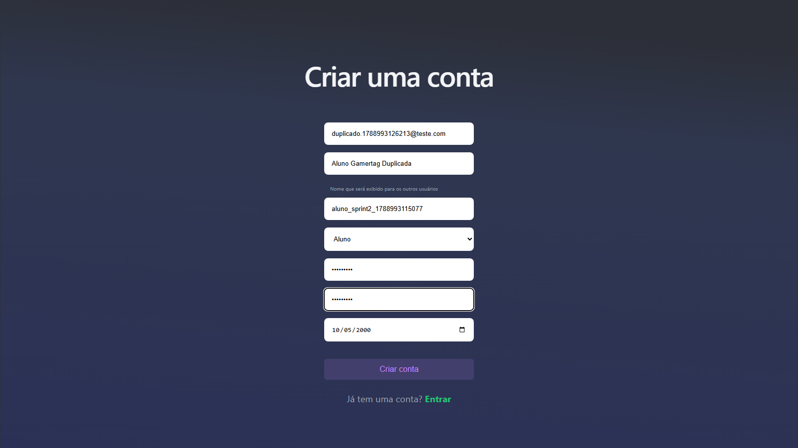

**Depois — cadastro bloqueado e mensagem de erro apresentada**

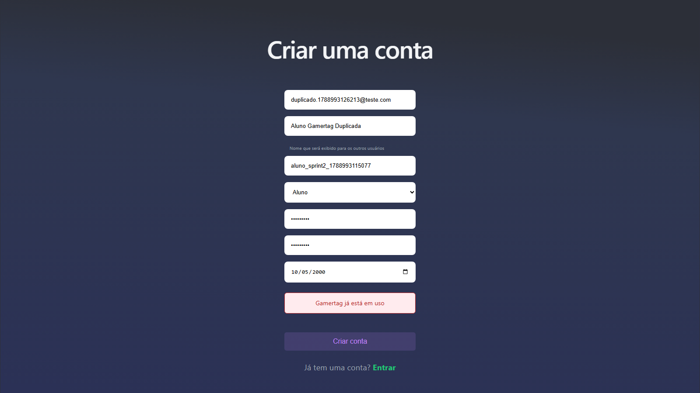

---

## 3.2 Utilização do usuário autenticado no histórico e ranking

O histórico e o ranking utilizavam anteriormente uma identificação fixa de usuário. O fluxo foi alterado para utilizar a identificação do usuário efetivamente autenticado na aplicação.

Após o login, o identificador do usuário é armazenado na sessão local e utilizado nas requisições relacionadas ao histórico, desempenho e ranking.

### Testes realizados

A alteração foi validada principalmente pelos testes:

- `test-auth-history.ps1`;
- `test-ranking-user.ps1`.

Os testes verificam se as consultas deixam de depender de um identificador fixo e retornam informações correspondentes ao usuário informado/autenticado.

O fluxo validado pode ser representado por:

```text
 Login
   ↓
Usuário autenticado
   ↓
Identificação do usuário
   ↓
Consulta de histórico/ranking
   ↓
Back-end
   ↓
Dados correspondentes ao usuário
```

No teste de histórico, é verificado se as partidas recuperadas estão associadas ao usuário utilizado na consulta.

No teste de ranking, é verificado se a identificação do usuário é considerada na consulta do ranking e das relações utilizadas para sua composição.

### Resultado

Os dois testes foram concluídos com sucesso, confirmando a substituição do usuário fixo pelo usuário autenticado.

**Resultado — histórico associado ao Aluno autenticado**


**Resultado — ranking associado ao Aluno autenticado**

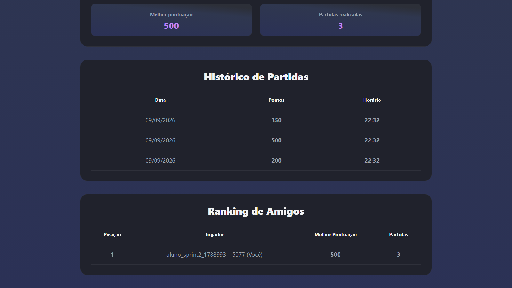

> **Observação:** as screenshots demonstram o resultado apresentado ao usuário. A associação dos dados ao identificador correto é verificada pelos testes automatizados.

---

## 3.3 Persistência das alterações dos dados do Perfil

Foi verificado o fluxo de atualização dos dados do Perfil para garantir que as alterações realizadas pelo usuário não fossem mantidas apenas na interface, mas fossem efetivamente enviadas ao back-end e persistidas no banco de dados PostgreSQL.

### Teste realizado

Para essa validação, foi utilizado o teste automatizado `test-profile-update.ps1`.

O teste executa o seguinte fluxo:

1. identifica um usuário existente no banco de dados e armazena seus dados originais;
2. envia uma requisição de atualização ao endpoint de Perfil do back-end;
3. consulta novamente o usuário diretamente no banco de dados;
4. compara os valores armazenados com os dados enviados na atualização;
5. após a validação, restaura os dados originais do usuário, evitando alterações permanentes provocadas pelo teste.

**Fluxo validado:**

```text
Dados originais
       ↓
Alteração do Perfil
       ↓
PUT /users/:id
       ↓
   Back-end
       ↓
Atualização no PostgreSQL
       ↓
Consulta dos dados persistidos
       ↓
Comparação com os valores enviados
       ↓
Restauração dos dados originais
```

### Resultado

O teste foi concluído com sucesso, confirmando que as alterações realizadas no Perfil são efetivamente persistidas no PostgreSQL.

**Resultado — Perfil do Aluno**

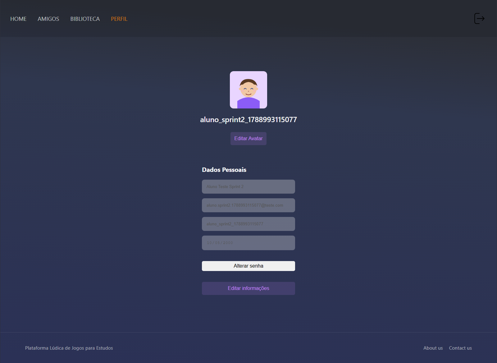

**Resultado — Perfil do Professor**


> **Observação:** as screenshots registram as telas de Perfil utilizadas durante a validação visual. A confirmação da persistência no back-end e no banco de dados é realizada pelo teste automatizado `test-profile-update.ps1`.

---

## 3.4 Recuperação automática do avatar no login

O fluxo de autenticação foi ajustado para recuperar automaticamente o avatar associado ao usuário após a realização do login.

A finalidade da alteração é garantir que a configuração de avatar carregada pela aplicação corresponda ao usuário da sessão atual.

### Teste realizado

A funcionalidade foi validada pelo teste `test-avatar-login.ps1`.

O teste verifica o comportamento da API responsável pela recuperação do avatar a partir do identificador do usuário.

Foram considerados os cenários necessários para confirmar que:

1. o avatar é consultado utilizando o usuário correto;
2. quando existe avatar associado ao usuário, os dados correspondentes podem ser recuperados;
3. quando não existe avatar cadastrado, a ausência é tratada corretamente.

No fluxo de login da aplicação, esse resultado é utilizado para atualizar os dados locais da sessão, evitando que informações de avatar pertencentes a um usuário anterior sejam reutilizadas.

**Fluxo validado:**

```text
Login realizado
      ↓
Identificação do usuário
      ↓
Consulta do avatar
      ↓
GET /avatars/:id
      ↓
Avatar encontrado?
   ↙             ↘
 Sim             Não
  ↓               ↓
Carrega       Trata ausência
avatar        de avatar
```

### Resultado

O teste foi concluído com sucesso.

Na execução visual oficial, os usuários criados especificamente para a Sprint 2 ainda não possuíam avatar cadastrado. Nesse cenário, a aplicação tratou corretamente o retorno sem avatar.

---

## 3.5 Melhoria da tela de detalhamento do jogo

A tela de detalhamento foi ampliada para contemplar os requisitos definidos pelo professor:

1. Poder voltar;
2. Ter descrição mais extensa do jogo;
3. Detalhes do jogo como tempo estimado de uma partida, faixa etária e quantidade de jogadores;
4. Detalhes de como o jogador foi no jogo, como melhor pontuação e quantidade de partidas;
5. Exibir ranking dos amigos com a melhor pontuação e quantidade de partidas.

### Teste realizado

A funcionalidade foi validada principalmente pelo teste `test-game-details.ps1` e complementada pela validação visual automatizada.

O teste verifica:

1. se os dados adicionais do jogo são retornados;
2. se a quantidade de partidas do usuário é calculada corretamente;
3. se a melhor pontuação corresponde ao maior resultado registrado;
4. se o ranking é retornado com as informações esperadas;
5. se a ordenação e a consistência dos dados estão corretas.

Para a execução visual oficial, foram registradas três partidas para o usuário Aluno:

| Partida | Pontuação |
|---:|---:|
| 1 | 200 |
| 2 | 500 |
| 3 | 350 |

A partir desses dados, o resultado esperado era:

```text
Quantidade de partidas = 3
Melhor pontuação = 500
```

**Fluxo validado:**

```text
Usuário acessa um jogo
        ↓
Detalhamento do jogo
        ↓
Dados gerais + histórico
        ↓
Cálculo do desempenho
        ↓
Quantidade de partidas = 3
Melhor pontuação = 500
        ↓
Consulta do ranking
        ↓
Apresentação na interface
```

### Resultado

Os cinco grupos de validação do teste automatizado foram concluídos com sucesso.

A interface apresentou corretamente as informações gerais do jogo, o desempenho do usuário, o histórico e o ranking.

**Resultado — informações gerais do jogo**

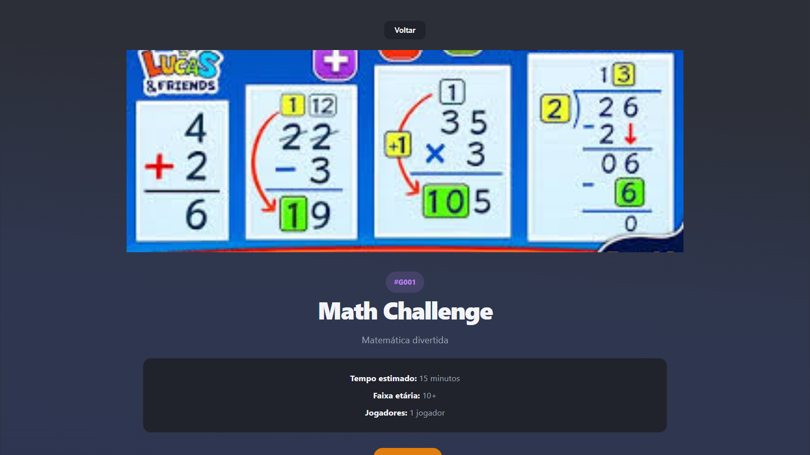

**Resultado — detalhamento completo**

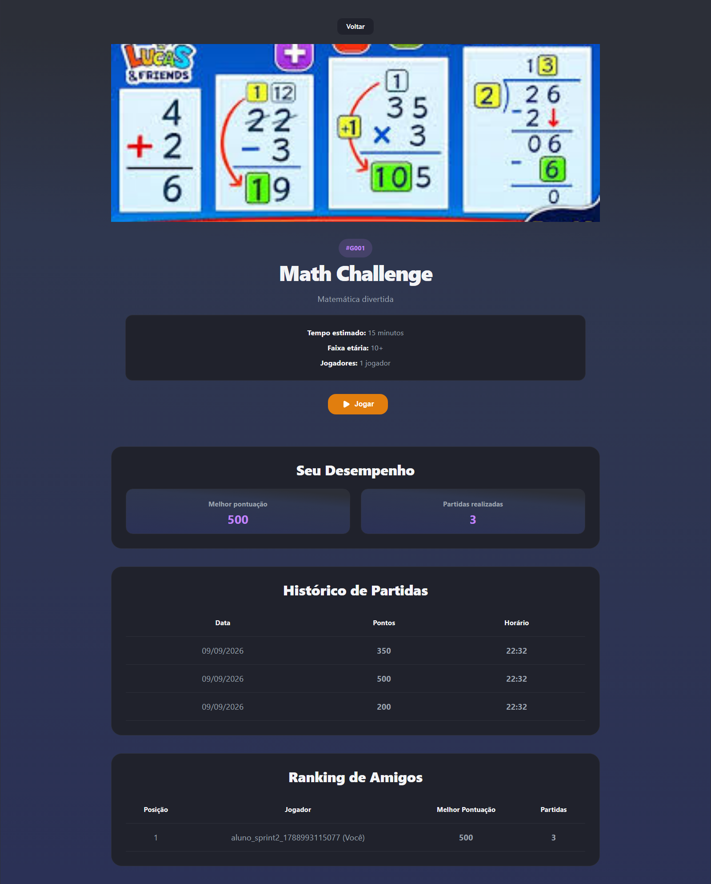

**Resultado — desempenho do jogador**

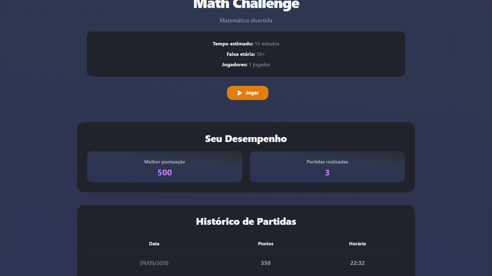

**Resultado — histórico das partidas**


**Resultado — ranking dos amigos**


Os requisitos funcionais da tela foram atendidos. Entretanto, durante a validação foi identificado que o **design da tela ainda necessita de aprimoramento**, principalmente em relação à organização das informações, hierarquia visual e disposição dos componentes.

O aprimoramento do design foi incluído entre as próximas atividades.

---

## 3.6 Tipo de jogador no cadastro

O cadastro foi atualizado para permitir a seleção entre **Aluno** e **Professor**, conforme solicitado para a Sprint.

Durante a implementação, a modelagem foi organizada de forma a distinguir o perfil funcional do usuário de seu nível de acesso no sistema.

### Testes realizados

A funcionalidade foi validada principalmente pelos testes:

- `test-user-profile.ps1`;
- `test-login-profiles.ps1`.

O primeiro teste verifica o cadastro e a persistência dos perfis. O segundo confirma que as informações de tipo e perfil são recuperadas corretamente durante a autenticação.

O fluxo validado é:

```text
Cadastro
   ↓
Seleção Aluno/Professor
   ↓
POST /users/register
   ↓
Persistência do perfil
   ↓
 Login
   ↓
Recuperação do tipo e perfil
   ↓
Comportamento correspondente
```

Os testes consideraram também o perfil Administrador para confirmar a separação entre nível de acesso e perfil de usuário.

### Resultado

Os testes foram concluídos com sucesso, confirmando o cadastro e a recuperação correta das informações de perfil.

**Resultado — cadastro com perfil Aluno**

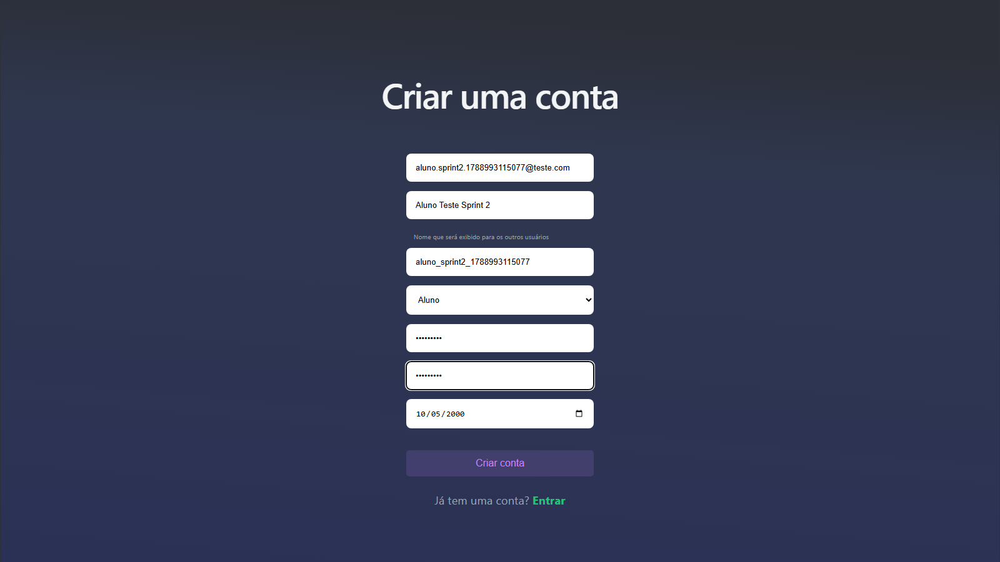

**Resultado — cadastro com perfil Professor**

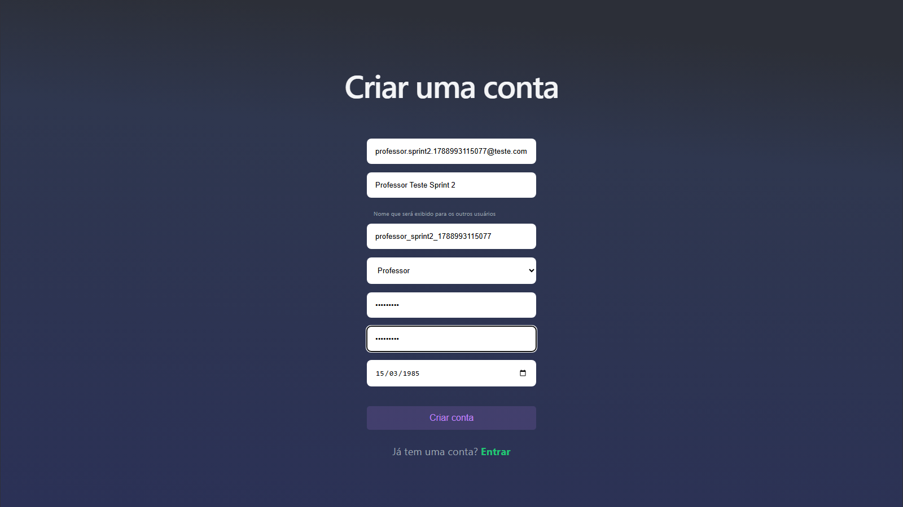

A diferenciação também pode ser observada na biblioteca.

**Resultado — biblioteca do Aluno**

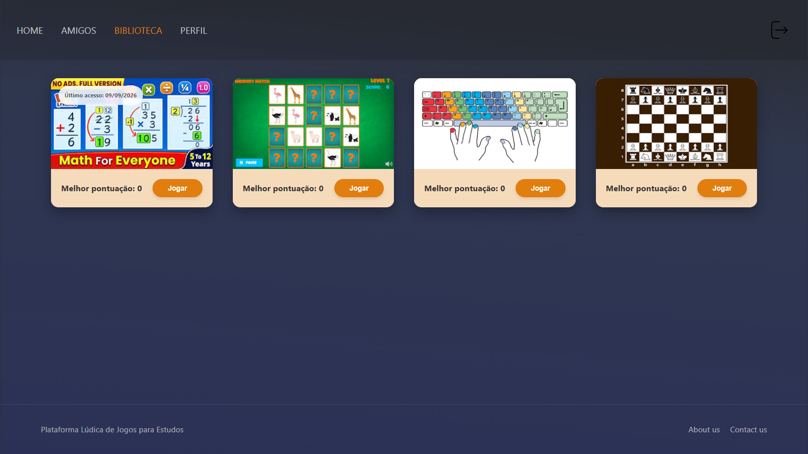

**Resultado — biblioteca do Professor**

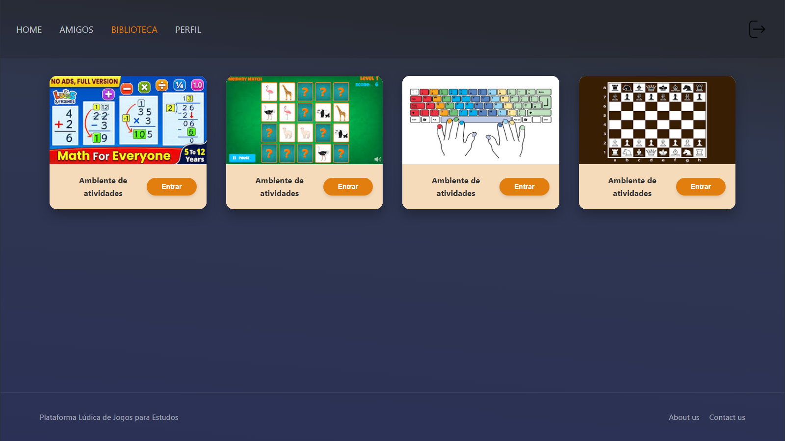

---

## 3.7 Regras de permissões e ranking por perfil

Além da persistência do perfil, foi necessário verificar se as regras correspondentes estavam sendo efetivamente aplicadas pelo sistema.

### Testes realizados

Foram utilizados:

- `test-game-permissions.ps1`;
- `test-ranking-profiles.ps1`.

O teste de permissões verifica o registro de partidas para os diferentes perfis.

Foram validados os seguintes comportamentos:

| Perfil | Registro de partida | Ranking |
|---|---|---|
| Aluno | Permitido | Participa |
| Professor | Bloqueado | Não participa |
| Administrador | Permitido para teste | Não participa |

Para o Professor, a tentativa de registro de uma partida é enviada diretamente ao back-end. Isso garante que a regra não dependa apenas da ausência de um botão na interface.

**Fluxo de permissão validado:**

```text
Tentativa de registrar partida
           ↓
       Perfil?
     ↙     ↓      ↘
 Aluno Professor Admin
   ↓       ↓       ↓
Permite  Bloqueia Permite
          ↓
       HTTP 403
```

O teste de ranking verifica separadamente se apenas os perfis autorizados aparecem nos resultados competitivos.

### Resultado

A tentativa de registrar uma partida com o perfil Professor retornou:

```text
HTTP 403
{"error":"Professor não pode participar de partidas"}
```

O teste confirmou ainda que:

- o Aluno consegue registrar partidas;
- o Administrador consegue registrar partidas utilizadas para teste;
- o Professor não possui partida registrada;
- Professor e Administrador não aparecem no ranking competitivo.

Todos os casos foram aprovados.

**Resultado — ambiente apresentado ao Professor**

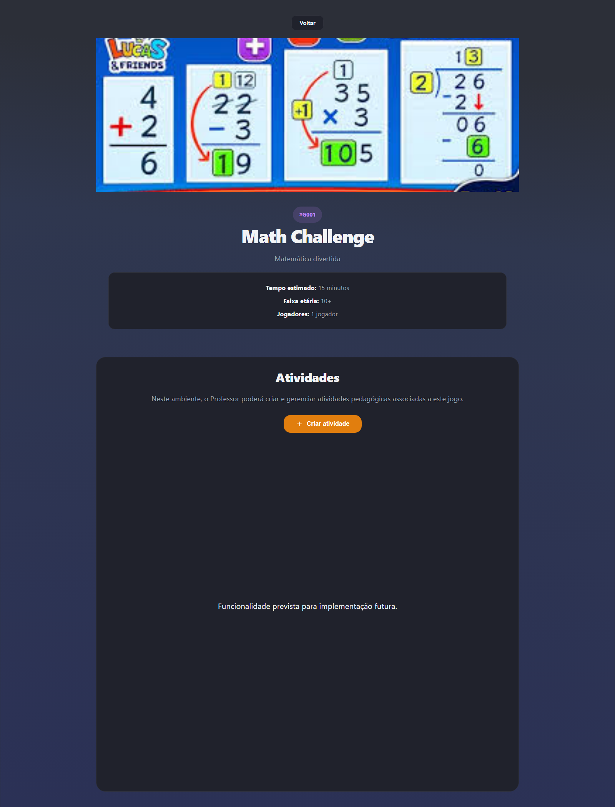

**Resultado — área de atividades do Professor**

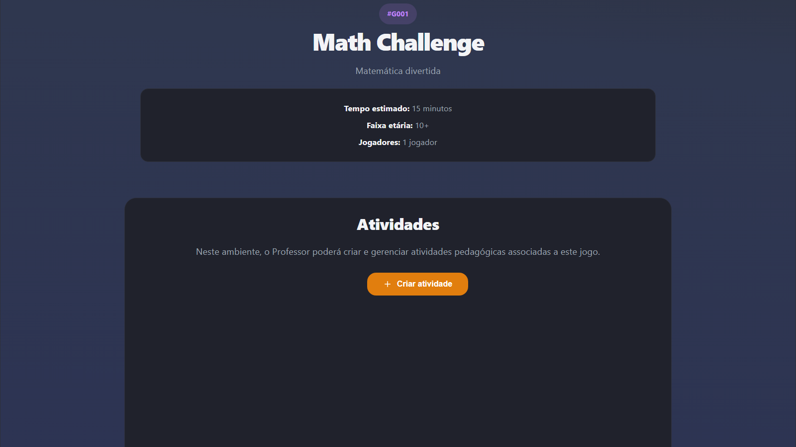

---

## 3.8 Levantamento do perfil Administrador

O item 7 da Sprint previa o levantamento dos tipos de ações que poderiam ser realizadas exclusivamente pelo perfil Administrador.

Diferentemente dos itens anteriores, esta atividade possui caráter de **levantamento funcional**, e não de implementação completa de uma nova área administrativa.

Como possibilidades iniciais foram identificadas:

- gerenciamento de usuários;
- gerenciamento de recursos da plataforma;
- acesso a funcionalidades administrativas;
- realização de testes dos jogos;
- aplicação de regras diferenciadas de acesso e visibilidade.

Durante os testes de permissões e ranking, também foi estabelecida uma regra já necessária ao funcionamento atual: partidas realizadas pelo Administrador para fins de teste não devem resultar em participação no ranking competitivo.

A implementação completa do comportamento específico do Administrador permanece prevista como trabalho futuro.

---

# 4. Resultados consolidados dos testes

| ID | Teste | Validação | Resultado |
|---|---|---|---|
| T01 | `test-gamertag.ps1` | Unicidade da Gamertag | Aprovado |
| T02 | `test-auth-history.ps1` | Histórico conforme usuário autenticado | Aprovado |
| T03 | `test-ranking-user.ps1` | Ranking conforme usuário autenticado | Aprovado |
| T04 | `test-profile-update.ps1` | Persistência dos dados do Perfil | Aprovado |
| T05 | `test-avatar-login.ps1` | Recuperação automática do avatar | Aprovado |
| T06 | `test-game-details.ps1` | Dados do jogo, desempenho e ranking | Aprovado |
| T07 | `test-user-profile.ps1` | Cadastro e persistência dos perfis | Aprovado |
| T08 | `test-login-profiles.ps1` | Recuperação do tipo e perfil no login | Aprovado |
| T09 | `test-ranking-profiles.ps1` | Participação dos perfis no ranking | Aprovado |
| T10 | `test-game-permissions.ps1` | Permissões para registro de partidas | Aprovado |
| T11 | `screenshots-sprint2.js` | Fluxos visuais e geração de evidências | Aprovado |

A execução final da bateria automatizada e da validação visual apresentou:

```text
TODAS AS VALIDAÇÕES DA SPRINT 2 PASSARAM
```

Os retornos `HTTP 400` do teste de Gamertag duplicada e `HTTP 403` da tentativa de partida do Professor representam **resultados esperados dos testes negativos** e não erros da execução.

---

# 5. Usuários utilizados na validação

Para permitir a reprodução das evidências, os usuários utilizados na execução oficial foram mantidos no ambiente local.

> **Nota:** as credenciais abaixo pertencem exclusivamente a usuários locais de teste e não devem ser utilizadas em ambiente de produção.

## 5.1 Aluno

| Campo | Valor |
|---|---|
| ID | 48 |
| Nome | Aluno Teste Sprint 2 |
| Gamertag | `aluno_sprint2_1788993115077` |
| E-mail | `aluno.sprint2.1788993115077@teste.com` |
| Data de nascimento | 2000-05-10 |
| Tipo | Usuario |
| Perfil | Aluno |
| Senha | `Teste123!` |

## 5.2 Professor

| Campo | Valor |
|---|---|
| ID | 49 |
| Nome | Professor Teste Sprint 2 |
| Gamertag | `professor_sprint2_1788993115077` |
| E-mail | `professor.sprint2.1788993115077@teste.com` |
| Data de nascimento | 1985-03-15 |
| Tipo | Usuario |
| Perfil | Professor |
| Senha | `Teste123!` |

---

# 6. Evidências da Sprint

As evidências da execução oficial estão armazenadas em:

```text
Ludica/
└── tests/
    └── screenshots/
        └── sprint2/
```

Como este relatório está localizado na raiz do projeto `Ludica`, as imagens são referenciadas por caminhos relativos:

```text
./tests/screenshots/sprint2/<arquivo>.png
```

O arquivo:

```text
tests/screenshots/sprint2/manifest.json
```

consolida os dados utilizados na execução e a relação das evidências geradas.

---

# 7. Dificuldades encontradas

As principais dificuldades encontradas durante a Sprint foram:

### 7.1 Adequação do modelo de perfis

Foi necessário distinguir o nível de acesso (`tipo_usuario`) do perfil funcional (`perfil_usuario`) e definir adequadamente o comportamento esperado para Aluno, Professor e Administrador.

### 7.2 Consistência das permissões entre front-end e back-end

As restrições não poderiam existir apenas na interface. Foi necessário aplicá-las também no back-end para impedir operações não autorizadas realizadas diretamente pela API.

### 7.3 Adequação do histórico e ranking ao usuário autenticado

A substituição do usuário fixo exigiu alterações em diferentes partes da aplicação para garantir que histórico, desempenho e ranking fossem associados à conta correta.

### 7.4 Regras de ranking por perfil

As consultas precisaram ser ajustadas para impedir que perfis não competitivos fossem apresentados nos rankings.

### 7.5 Persistência dos dados do Perfil

Foram necessários ajustes entre os campos utilizados no front-end, no serviço do back-end e no banco de dados para garantir a persistência correta das alterações.

### 7.6 Tratamento visual da Gamertag duplicada

Embora o back-end já rejeitasse a duplicidade, foi necessário aprimorar a apresentação do erro no front-end e posteriormente ajustar a automação para aguardar a mensagem antes de gerar a evidência.

### 7.7 Automatização das evidências

Os scripts precisaram ser ajustados para garantir que as screenshots fossem capturadas no estado correto da aplicação e para distinguir respostas esperadas de testes negativos de falhas reais da validação.

As dificuldades foram tratadas durante a Sprint e a execução final foi concluída sem erros de validação.

---

# 8. Situação ao final da Sprint

Ao final da Sprint 2, os requisitos definidos para a semana foram atendidos.

Foram concluídos:

- unicidade da Gamertag;
- utilização do usuário autenticado no histórico e ranking;
- persistência das alterações dos dados do Perfil;
- recuperação automática do avatar no login;
- melhorias funcionais da tela de detalhamento;
- inclusão dos perfis Aluno e Professor no cadastro;
- levantamento inicial das possíveis ações do Administrador.

A tela de detalhamento atende funcionalmente aos requisitos solicitados, porém seu **design ainda deverá ser aprimorado**.

---

# 9. Próximas atividades

## 9.1 Melhorias identificadas durante a Sprint 2

### Aprimoramento do design da tela de detalhamento

Revisar o design da tela de detalhamento dos jogos, buscando melhorar:

- organização das informações;
- hierarquia visual;
- disposição dos componentes;
- legibilidade;
- experiência de navegação.

### Identificação do usuário autenticado

Aprimorar o cabeçalho global da aplicação para apresentar de forma persistente:

- avatar;
- Gamertag;
- indicação visual do perfil (`Aluno`, `Professor` ou `Administrador`).

## 9.2 Trabalhos futuros indicados pelo professor

Permanecem no planejamento futuro:

- visualização de perfis dos amigos, podendo visualizar avatares e pontuações nos jogos;
- implementação do comportamento específico do perfil Administrador;
- integração dos jogos como aplicações separadas por API;
- loja de itens para Avatar utilizando pontos;
- sistema de conquistas.

Esses itens permanecem como trabalhos futuros e não representam requisitos pendentes da Sprint 2.

---

# 10. Conclusão

A Sprint 2 permitiu implementar e validar as correções e melhorias funcionais definidas após a Sprint 1.

Além da implementação, foi dada maior ênfase à **verificação objetiva dos requisitos**. Os testes passaram a validar não somente o comportamento apresentado pela interface, mas também as respostas do back-end, a persistência no banco de dados e as regras de autorização associadas aos diferentes perfis.

A execução final dos testes automatizados e da validação visual foi concluída sem erros de validação.

Como continuidade, o projeto deverá avançar no aprimoramento das interfaces identificadas durante os testes e nas funcionalidades previstas para as próximas etapas.

---

# 11. Referências

- LÚDICA. **Manual do Usuário**. Versão atualizada em 27/06/2026.
- LÚDICA. **Manual do Desenvolvedor — Plataforma de Aprendizagem Lúdica**. Versão atualizada em 27/06/2026.
- LÚDICA. **Documento de Trabalho Futuro**.
- LÚDICA. **Relatório de Acompanhamento — Sprint 01**.
- LÚDICA. **Scripts automatizados de testes e evidências da Sprint 2**.